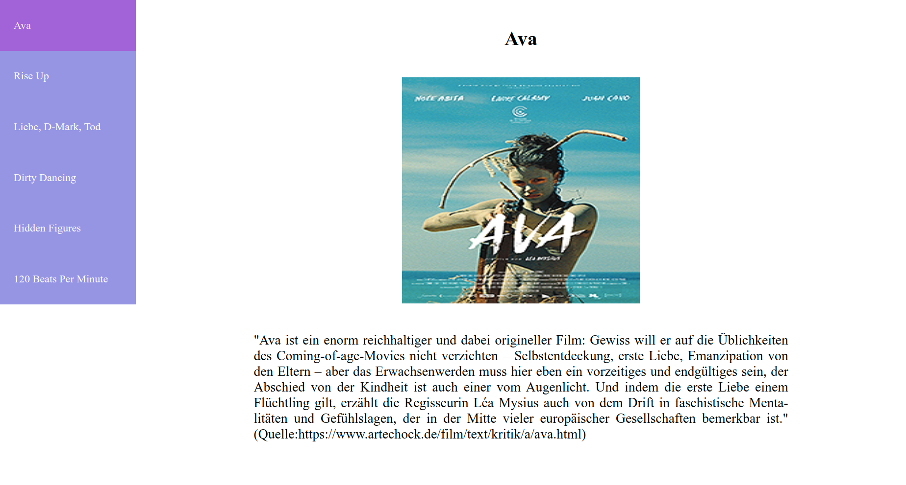

# Choose your favorite movie

## Exercise Course-Module 3 - Intro Single Page Application (SPA) - HTML/CSS/JavaScript

created at 27.01.23;

As a first step in SPA-Module, I learned to work with Document Object Model (DOM-Manipulation).
Oriented to the demo.gif I wrote a js-function that adds and handles a dynamic pill behavior to the menue-list-items: On click, the selected list item is displayed with a different background color & the content of the page (_title_, _image_ and _movie description_) updates according to the selected list-item/movie.

### My Version:

### Mockup:

### Info & Image Ressources:

#### Ava -

furioses Coming of Age, Antiziganismus und female Empowerment

Image-Source: https://www.programmkino.de/filmkritiken/ava/

---

"Ava ist ein enorm reich­hal­tiger und dabei origi­neller Film: Gewiss will er auf die Üblich­keiten des Coming-of-age-Movies nicht verzichten – Selbst­ent­de­ckung, erste Liebe, Eman­zi­pa­tion von den Eltern – aber das Erwach­sen­werden muss hier eben ein vorzei­tiges und endgül­tiges sein, der Abschied von der Kindheit ist auch einer vom Augen­licht.
Und indem die erste Liebe einem Flücht­ling gilt, erzählt die Regis­seurin Léa Mysius auch von dem Drift in faschis­ti­sche Menta­litäten und Gefühls­lagen, der in der Mitte vieler europäi­scher Gesell­schaften bemerkbar ist."
https://www.artechock.de/film/text/kritik/a/ava.htm

#### Rise Up -

RISE UP - Heimgesucht von Albträumen, auf der Suche nach Träumenden
Ein Film von Marco Heinig, Steffen Maurer, Luise Burchard und Luca Vogel.
89 Min., DE/OmU, 2022.
„Rise Up“ sucht gemeinsam mit fünf außergewöhnlichen politischen Aktivist:innen Antworten auf die verheerenden ökologischen, wirtschaftlichen und autoritären Entwicklungen unserer Zeit.
https://www.riseup-film.de/
Image-Source: https://www.neuevisionen.de/de/filme/rise-up-122

#### Liebe, D-Mark, Tod -

"In einer nahtlosen Mischung aus Archivmaterial, sprechenden Personen und prägnanten Zwischentiteln erzählt Regisseur Cem Kaya die universelle Geschichte des Kampfes von Neuankömmlingen um Würde und Respekt in einer neuen und oft feindlichen Umgebung..."
https://chicagoreader.com/film/review-love-deutschmarks-death/

#### Dirty Dancing -

The theme of Dirty Dancing, as detailed in the film, was one of social and political class structure and female empowerment. Though many people came away from this blockbuster thinking they’d seen a sweet coming-of-age film whose main characters, portrayed by Jennifer Grey and Patrick Swayze, had sexual chemistry that was off the chain, some of us knew it was also making a social statement regarding the coming women’s liberation movement. The main character’s political awakening is front and center, as indicated by her outspokenness and, more importantly, her willingness to help a woman get an illegal abortion.

https://laurelanne.media/the-hidden-politics-of-dirty-dancing

#### Hidden Figures -

"Hidden Figures" tells the incredible untold story of Katherine Jonson (Taraji P. Henson), Dorothy Vaughan (Octavia Spencer) and Mary Jackson (Janelle Monae) – brilliant African-American women working at NASA who served as the brains behind the launch into orbit of astronaut John Glenn, a stunning achievement that turned around the space race. The visionary trio crossed all gender and racial line and inspired generations.
https://family.20thcenturystudios.com/movies/hidden-figures

#### 120 Beats Per Minute -

Robin Campillo’s superb story of Aids activists in the 1990s is more than just a revelatory period piece – it’s a celebration of sex, dance and the invigorating value of collective resistance.
https://www2.bfi.org.uk/news-opinion/sight-sound-magazine/reviews-recommendations/120-bpm-beats-per-minute-robin-campillo-aids-act-up-call-action
